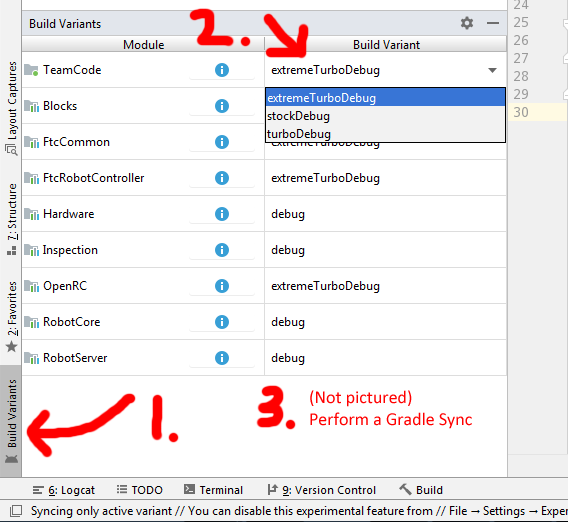

## OpenRC-Turbo

OpenRC is a modified version of the official [FTC SDK](https://github.com/FIRST-Tech-Challenge/SkyStone)
in which all of the source code that is normally tucked away inside the AAR files has been extracted into modules. This makes it easy to see and modify almost the entirety of the Robot Controller app's source code. In addition, the history in Git shows all changes that have been made to the core code since OpenRC's inception. This complements the changelogs that FIRST provides, allowing teams to see exactly what code has been changed.


## Legality for competition use

According to the [2019-2020 Game Manual Part 1](https://www.firstinspires.org/sites/default/files/uploads/resource_library/ftc/game-manual-part-1.pdf), teams are not allowed to replace or modify the portions of the SDK which are distributed as AAR files, per `<RS09>`. This means that in its default configuration, OpenRC is **not** legal for competition.

**HOWEVER**, in order to address this, OpenRC has a `stock` build variant which will compile the `TeamCode` and `FtcRobotController` modules against the official, unmodified AAR files, rather than against the extracted modules.

## Device Compatibility

Compatible with all legal FTC Robot Controller devices for the 2020-2021 season, including the Control Hub.

## Build variants

### Variant Descriptions

Normal SDK 5.5 APK size: 42MB

 - **Stock - 33.5MB APK** *(1.25x smaller)*
     - Competition legal
     - 64-bit libs removed

 - **Turbo - 9.2MB APK** *(4.5x smaller)*

     *Note: If you would like to use Blocks, you will need to copy your private Vuforia key into the `Blocks/src/main/assets/CzechWolf` file*
     - Vuforia native library loaded dynamically
     - Vuforia/TF datasets loaded dynamically
     - OnBotJava removed

 - **Extreme Turbo - 4.8MB APK** *(8.7x smaller)*
     - Vuforia native library loaded dynamically
     - Vuforia/TF datasets loaded dynamically
     - OnBotJava removed
     - Blocks removed
     - Sound files removed

### Benchmarks

|                            |**Nexus 5 (7.1.2)<br>Intel Centrino Advanced-N 6205 on Linux**|**Nexus 5 (7.1.2)<br>Intel Wireless 8260 on Linux**|
|:--------------------------:|:-----------------:|:------------------:|
|**Stock over WiFi**         |    30 sec           |  20 sec           |
|**Turbo over WiFi**         |    13 sec           |  11 sec           |
|**Extreme Turbo over WiFi** |    10 sec           |   8 sec           |

## Setup Process

 1. Fork this repository
 2. Clone your fork
 3. Do `git remote add upstream https://github.com/OpenFTC/OpenRC-Turbo.git`
 4. Copy all of the files found in the `filesForDynamicLoad` folder of this repo into the `FIRST/vision` folder on the RC's internal storage
 5. Select your desired build variant (see the *Switching Build Variants* section)

## Update Process

Assuming you followed the above setup process, all that you need to do to update your fork when a new OpenRC release is available is:

 1. `git pull upstream master`
 2. Perform a Gradle Sync
 3. If the project fails to build, try *Clean Project*, *Rebuild Project*, and *Invalidate Caches / Restart*

## Switching Build Variants

**IMPORTANT: make sure to test that your project compiles correctly with the stock variant at least a week before your competition!**

Note: you may get a "variant conflict" when switching variants. You can fix this by changing the conflicting module's variant to match the variant you want.

 1. Open the Build Variants tab in the lower left hand corner of Android Studio
 2. In the dropdown for the **TeamCode module**, select your desired variant
 3. Perform a Gradle sync



## Versioning Scheme

To prevent confusion, OpenRC does not have its own version number. The version number will directly reflect the SDK version that the release is based on. However, the version number will have a letter appended to the end of it, which will be incremented (A-Z) for each release of OpenRC which is based on the same SDK version. When OpenRC is updated to be based on a new SDK version, the letter will reset to A.

For instance, the 3rd release of OpenRC based on SDK v5.0 would be `5.0C`, whereas the first release of OpenRC based on SDK v5.1 would be `5.1A`.

## Dynamic Loading of TensorFlow and Vuforia Datasets

In order to reduce APK size, the Turbo and Extreme Turbo variants do not bundle the Vuforia and TensorFlow datasets in the APK. However, once copied onto the internal storage (see step #4 in the *Setup Process* section), you can still use them in your OpMode by making a very minor change.

**NOTE:** The samples in this repo have already been adjusted with this change.

```java
/*
 * For Vuforia
 */
// Find a line similar to this in the program
vuforia.loadTrackablesFromAsset("DatasetName");
// And replace it with this (obviously adjusting the DatasetName)
vuforia.loadTrackablesFromFile("/sdcard/FIRST/vision/DatasetName");

/*
 * For TensorFlow
 */
// Find a line similar to this in the program
tfod.loadModelFromAsset("DatasetName.tflite");
// And replace it with this (obviously adjusting the DatasetName)
tfod.loadModelFromFile("/sdcard/FIRST/vision/DatasetName.tflite");

```


## Release Notes:

### 6.1A

Released on 18 December 2020

 - Updates to SDK v6.1
 - Fixes issue #9

### 6.0A

Released on 25 September 2020

 - Updates to SDK v6.0
 - Changes vision datasets to be loaded from `vision` subfolder of `FIRST` folder to prevent the Vuforia XML files from appearing in the configuration editor

### 5.5B

Released on 30 August 2020

 - Shrinks Turbo/ExtremeTurbo APK size by a few hundred KB since 5.5A release
 - Adds core web management to Extreme Turbo variant, increasing compatibility with Control Hub
 - Logs build variant to RobotLog

### 5.5A

Released on 28 August 2020

 - Update to SDK v5.5

### 5.4B

Released on 11 August 2020

 - Improve compatibility with Control Hub

### 5.4A

Released on 15 January 2020

 - Update to SDK v5.4

### 5.3B

Released on 22 November 2019

 - Fix TFOD crash on stock due to incorrect version of TFOD library being used (which conflicted with pre-compiled official FTC SDK AARs)

### 5.3A

Released on 19 October 2019

 - Update to SDK v5.3

### 5.2B

Released on 19 September 2019

 - Remove universal Blocks Vuforia key per request of FIRST. If you would like to use Blocks, you will need to copy your private Vuforia key into the `Blocks/src/main/assets/CzechWolf` file.

### 5.2A

Released on 11 September 2019

 - Update to SDK v5.2
 - **NOTE:** You will need to copy some additional files to the `FIRST` folder of the internal storage after you update. See step #4 in the *Setup Process* section
 - **NOTE:** The TensorFlow and Vuforia sample OpModes for SKYSTONE have been modified slightly to load the datasets from internal storage. **Use the samples in this repo; the stock samples will fail on variants other than stock.** Please also see the *Dynamic Loading of TensorFlow and Vuforia Datasets* section of this readme.

### 5.1A

Released on 26 August 2019

 - Update to SDK v5.1
 - Updated dynamic Vuforia loader to enforce being run on Android 6.0 or higher

### 5.0A

Released on 21 August 2019

 - Initial release.
